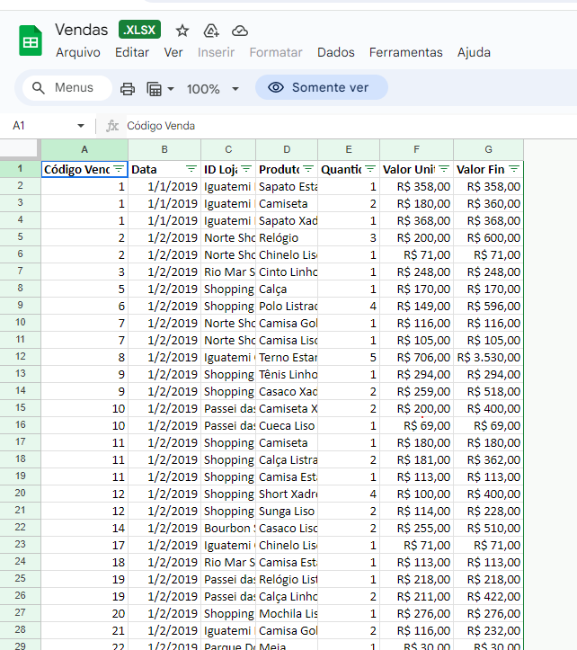
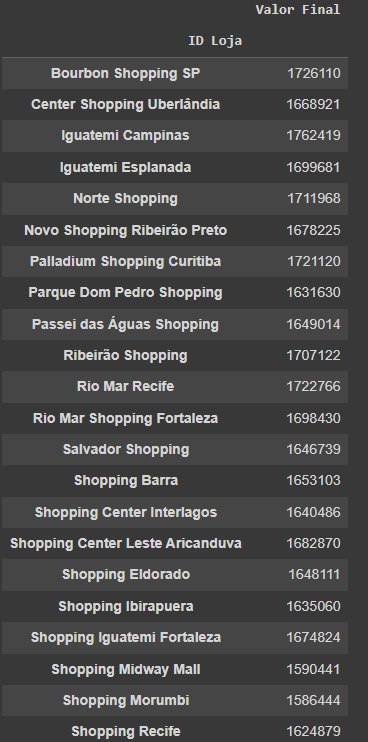
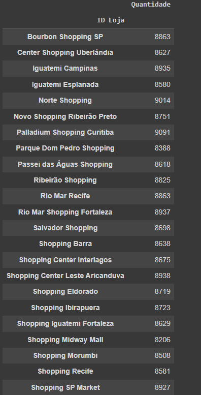
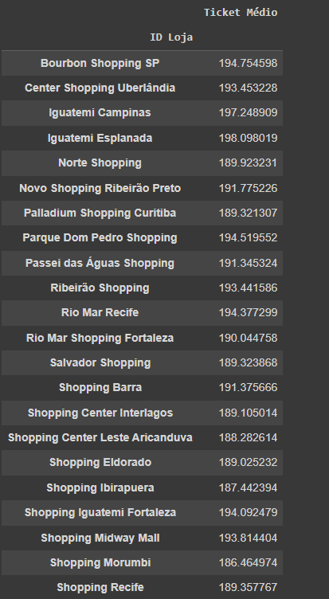
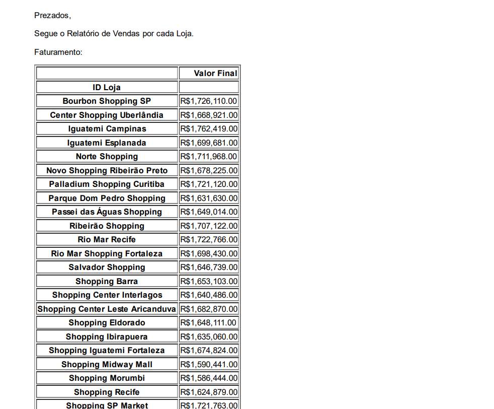
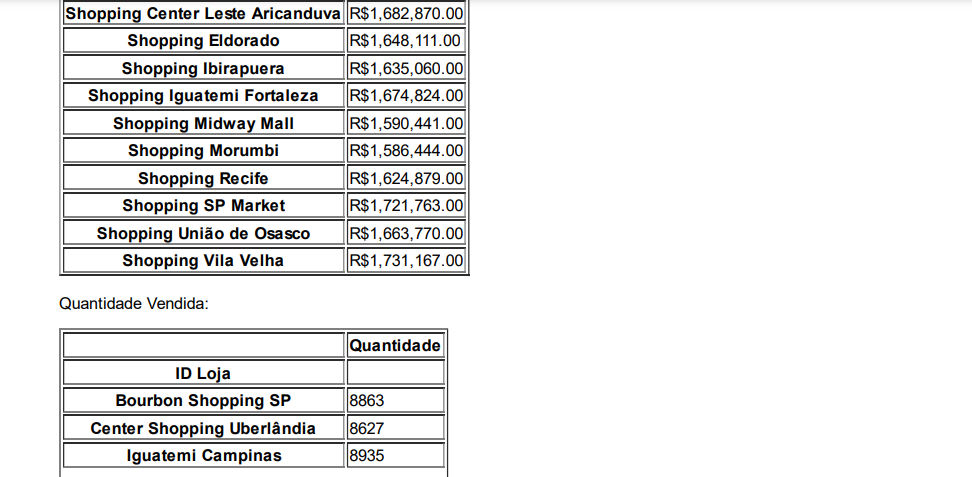
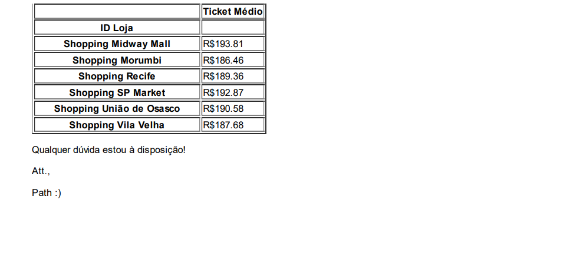

# Envio Automático de Relatórios em Python

O script utiliza bibliotecas Python para manipulação de e-mails e permite personalização de mensagens. Além disso, proporciona uma solução eficiente e personalizável para a distribuição automática dos relatórios relevantes para o negócio.

Este projeto foi desenvolvido através do curso básico de Python da Hashtag Treinamentos. Se você quiser aprender junto, o curso está disponível gratuitamente no link: 

<a href="https://pages.hashtagtreinamentos.com/minicurso-python-automacao-obrigado?blog=1n4033rer&video=3ivfkigsf">Minicurso Python - Automação</a>

## Funcionalidades

1. **Faturamento por Loja:** Apresenta os valores de faturamento de cada loja em um determinado período.

2. **Quantidade de Produtos Vendidos por Loja:** Fornece informações sobre a quantidade de produtos vendidos por cada loja.

3. **Ticket Médio:** Calcula e apresenta o ticket médio de vendas por loja.

## Info's

Programado inicialmente através do [Google Colab](https://colab.research.google.com/drive/1DMLfKW_5SXAN4WBRmZVN_sdNt93nRi_P?usp=sharing)

---
 

## Visualização das informações

- Tabela extraida do Drive:

- 1. Faturamento por Loja:

- 2. Quantidade de Produtos Vendidos por Loja:

- 3. Ticket Médio:

- Modelo do E-mail: 

